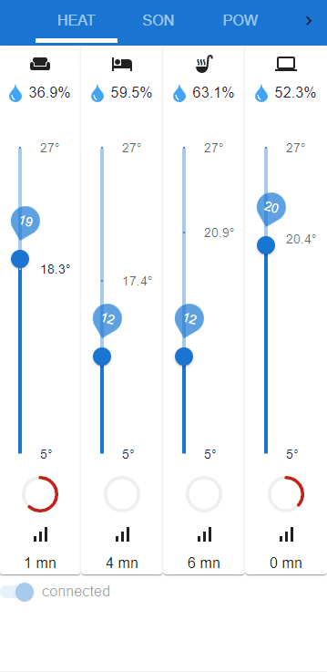

# Description
Next.js React with MUI Material UI Front End components for Zigbee 2 MQTT Home Heating Light sound Control and Grafana dashboards

repo for raspberry pi services : https://github.com/HomeSmartMesh/raspi
# Gif demo

## Running
- sonos switch on/off
## Plan
- bedroom roll
- shellies actions : Bathroom fan
- pc_power (disable enable)
- heating
- lights

# Getting Started

develop
```bash
npm run dev
```
build & export
```bash
npm run build
npm run export
```
export goes to `.out/` directory

# creation
This is a [Next.js](https://nextjs.org/) project bootstrapped with [`create-next-app`](https://github.com/vercel/next.js/tree/canary/packages/create-next-app).
